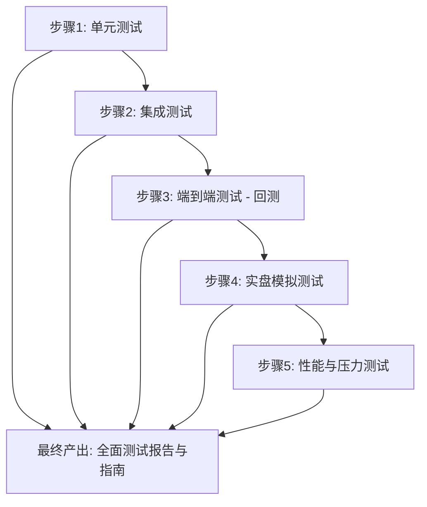

# 缠论港股交易系统测试指南

本指南旨在为您提供一个清晰、全面的测试方案，以验证系统的功能完整性、稳定性和交易策略的有效性。测试将分层进行，从独立的单元测试到完整的端到端模拟交易。

## 测试计划概览

我将按照以下步骤来规划和执行测试：

---

### **步骤1: 单元测试 - 验证独立模块的正确性**

*   **目标**: 确保每个核心模块的功能符合预期。
*   **范围**:
    *   `Trade/db_util.py`: 测试数据库的增、删、改、查操作是否正常。
    *   `Config/EnvConfig.py`: 验证配置文件加载、默认值回退是否正确。
    *   `ChanModel/ExtendedFeatures.py`: 验证各类技术指标和组合特征计算的准确性。
    *   `Monitoring/metrics.py`: 独立验证P&L、夏普比率、最大回撤等性能指标计算的正确性。
*   **方法**: 我将为上述模块编写独立的测试脚本（例如 `tests/test_db_util.py`），使用预设的输入数据来验证输出结果。

### **步骤2: 集成测试 - 确保模块间协同工作**

*   **目标**: 验证模块之间的数据流和交互是否顺畅。
*   **范围**:
    *   **策略与数据**: `HkVisualStrategy.py` 能否正确调用 `db_util.py` 获取数据和保存信号。
    *   **模型与策略**: `hk_ml_model.py` 能否被策略正确加载和调用，并返回预测结果。
    *   **主程序与监控**: `futu_hk_visual_trading_fixed.py` 能否在执行后成功触发 `reporter.py` 生成报告。
*   **方法**: 我将编写模拟真实场景的测试脚本，将多个模块串联起来，检查它们之间的接口调用和数据传递。

### **步骤3: 端到端测试 (回测) - 评估策略在历史数据上的表现**

*   **目标**: 验证整个交易策略（包括视觉判断和机器学习模型）在历史数据上的有效性。
*   **范围**:
    *   运行 `backtesting/run_hk_visual_backtest.py` 脚本。
    *   分析生成的回测报告，评估关键绩效指标（KPIs），如总回报率、年化收益、夏普比率和最大回撤。
*   **方法**: 使用长时间跨度（例如，过去一年）的历史K线数据，对策略进行完整的回测，并与基准（如指数）进行比较。

### **步骤4: 实盘模拟测试 - 在模拟环境中验证完整流程**

*   **目标**: 在不产生真实资金风险的情况下，验证系统在实时数据流下的完整表现。
*   **范围**:
    *   配置系统使用券商提供的模拟交易账户。
    *   运行主程序 `futu_hk_visual_trading_fixed.py`。
    *   监控从信号发现、图表生成、AI评分、下单执行到最终邮件报告的全过程。
*   **方法**: 让系统在模拟环境中运行至少一个完整的交易日，观察日志、数据库记录和最终报告，确保所有环节都按预期工作。

### **步骤5: 性能与压力测试**

*   **目标**: 评估系统在高负载和长时间运行下的稳定性和资源消耗。
*   **范围**:
    *   **并发处理**: 增加 `watchlist` 中的股票数量，测试系统在处理大量股票时的性能。
    *   **内存泄漏**: 让程序长时间连续运行（例如72小时），监控内存和CPU使用率，检查是否存在资源泄漏。
*   **方法**: 我将设计专门的脚本来模拟高并发请求和长时间运行的场景。

---

## 交付成果

完成所有测试后，我将向您交付一份`TESTING_GUIDE.md`文件，其中包含：
1.  所有测试脚本的详细说明和使用方法。
2.  各阶段的测试结果汇总。
3.  基于测试结果对系统进行的任何必要优化和修复。

您对这个测试计划满意吗？如果同意，我将开始着手执行第一步：单元测试。