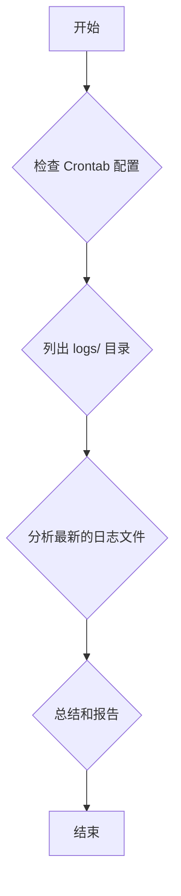

# 日志检查计划 (最终版)

根据你的最新反馈，我们在分析日志前，先检查 `crontab` 的配置。

## 最终计划步骤

1.  **检查 Crontab 配置**
    *   **目标**: 了解哪些脚本被配置为定时任务，以及它们的执行频率和命令。
    *   **方法**: 读取 `final_crontab.txt` 文件的内容。
    *   **理由**: 这是确定自动扫描任务真实入口点和执行逻辑的根本依据。

2.  **列出日志目录**
    *   **目标**: 确认 `logs/` 目录下所有可用的日志文件。
    *   **方法**: 使用 `ls -la logs/` 命令。
    *   **理由**: 确保我们没有遗漏任何可能相关的日志文件。

3.  **分析最新日志文件**
    *   **目标**: 根据 `crontab` 的配置，针对性地在 `logs/cron_output.log` 中找到最近一次扫描的执行记录、确认其状态（成功/失败）并查找错误。
    *   **方法**: 仔细阅读日志文件的尾部内容。
    *   **理由**: 这是获取任务执行状态最直接的方式。

4.  **总结并报告**
    *   **目标**: 清晰地回答你的问题。
    *   **方法**: 整理分析结果，报告最后一次运行时间以及发现的任何问题。
    *   **理由**: 完成任务闭环。

## 流程图

