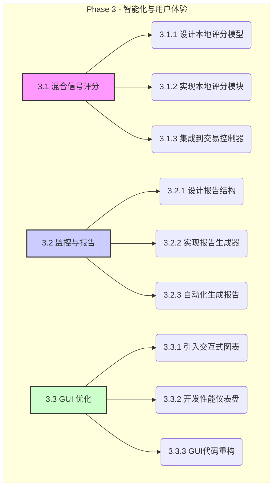

# Phase 3: 智能化与用户体验 - 详细实施计划

Phase 2的成功为我们构建了一个健壮可靠的交易执行框架。现在，Phase 3将专注于提升系统的“智慧”和“可用性”，通过引入更智能的信号筛选机制和更友好的用户界面，使系统不仅能稳定运行，更能高效、精准地辅助决策。

## 核心目标
1.  **提升信号质量与效率**: 引入本地快速筛选机制，减少对耗时较长的视觉AI的依赖，提高扫描速度和信号精准度。
2.  **增强态势感知能力**: 提供结构化的交易报告和实时的性能仪表盘，让用户对交易表现和系统状态一目了然。
3.  **优化用户交互体验**: 将静态图表升级为可交互图表，增强数据分析的直观性和便捷性。

---

### **任务 3.1: 构建混合信号评分系统 (本地快筛 + 视觉AI精筛)**

**背景**: 当前系统完全依赖视觉AI进行评分，虽然精准但效率不高。混合评分系统将结合本地计算的快速特征和视觉AI的精准判断，形成一个高效的二级过滤体系。

**实施步骤**:
1.  **设计本地评分模型**:
    *   **特征工程**: 提取缠论核心元素作为评分特征，例如：
        *   `BS点类型`: 不同买卖点的基础分值（如一买 > 二买）。
        *   `线段力度`: 上升/下降线段的斜率和长度。
        *   `MACD状态`: 背驰的强度、金叉/死叉的位置。
        *   `中枢状态`: 中枢的厚度、突破/回落的有效性。
    *   **权重分配**: 为不同特征设定可配置的权重，形成综合评分。

2.  **实现本地评分模块**:
    *   创建 `Trade/LocalScorer.py` 文件，实现一个 `LocalScorer` 类。
    *   该类接收缠论分析结果，根据配置的特征和权重，计算出0-100之间的本地分数。

3.  **集成到交易控制器**:
    *   在 `App/HKTradingController.py` 的信号收集中，增加本地评分环节。
    *   只有当一个信号的本地评分超过预设阈值（例如 `local_score_threshold: 60`），才会为其生成图表并提交给视觉AI进行最终评分。

---

### **任务 3.2: 完善监控与报告模块**

**背景**: 当前的日志输出较为零散，不利于系统性地复盘和分析。自动化的交易报告将解决这一问题。

**实施步骤**:
1.  **设计报告结构 (Markdown/HTML)**:
    *   **概览**: 总体盈亏、胜率、平均盈亏、交易总数。
    *   **交易详情**: 逐笔列出所有交易的细节（代码、买/卖、价格、数量、时间、信号评分）。
    *   **风险总结**: 熔断触发次数、最大回撤等。

2.  **实现报告生成器**:
    *   创建 `reports/ReportGenerator.py` 文件。
    *   该模块将从数据库的 `orders` 和 `risk_logs` 表中读取数据，生成指定时间范围的交易报告。

3.  **自动化生成**:
    *   在 `HKTradingController` 中添加逻辑，在每日交易结束后自动调用报告生成器，创建当天的交易报告。

---

### **任务 3.3: 优化GUI，引入可交互图表与性能仪表盘**

**背景**: 当前GUI的图表是静态图片，无法进行缩放、平移等交互操作，限制了深度分析的可能。同时，缺少一个集中的性能监控面板。

**实施步骤**:
1.  **引入交互式图表**:
    *   研究并选用如图 `pyqtgraph` 或 `Plotly` (通过`QWebEngineView`集成) 的交互式图表库。
    *   改造图表展示区域，当用户点击信号列表中的某一行时，动态加载并显示该信号对应的可交互K线图。

2.  **开发性能仪表盘**:
    *   在GUI中新增一个“仪表盘” (Dashboard) 标签页。
    *   **核心组件**:
        *   **资金仪表**: 使用仪表盘或进度条显示当前可用资金和总资产。
        *   **持仓结构**: 使用饼图展示不同股票的持仓比例。
        *   **盈亏曲线**: 使用折线图展示每日的累计盈亏变化。
        *   **风险状态**: 一个面板实时显示来自 `RiskManager` 的状态，如“熔断中(剩余xx秒)”或“正常运行”。

3.  **GUI代码重构**:
    *   为支持更复杂的界面，将 `ashare_bsp_scanner_gui.py` 中的UI布局代码和业务逻辑代码进行分离，提高可维护性。

---

### **Phase 3 架构图**

这个计划旨在通过三个关键维度的改进，将系统提升到一个新的高度。请您审阅此计划，如果满意，我将开始着手实施第一项任务：**构建混合信号评分系统**。